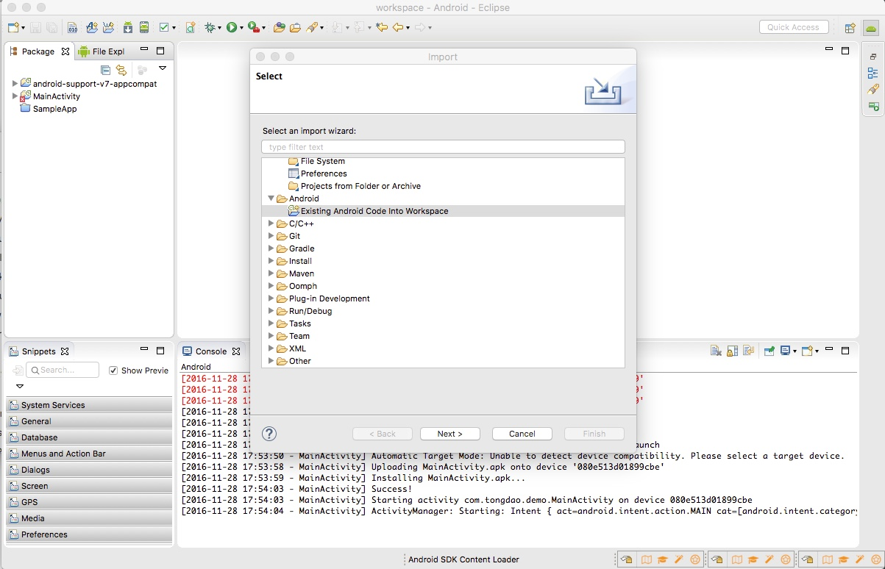
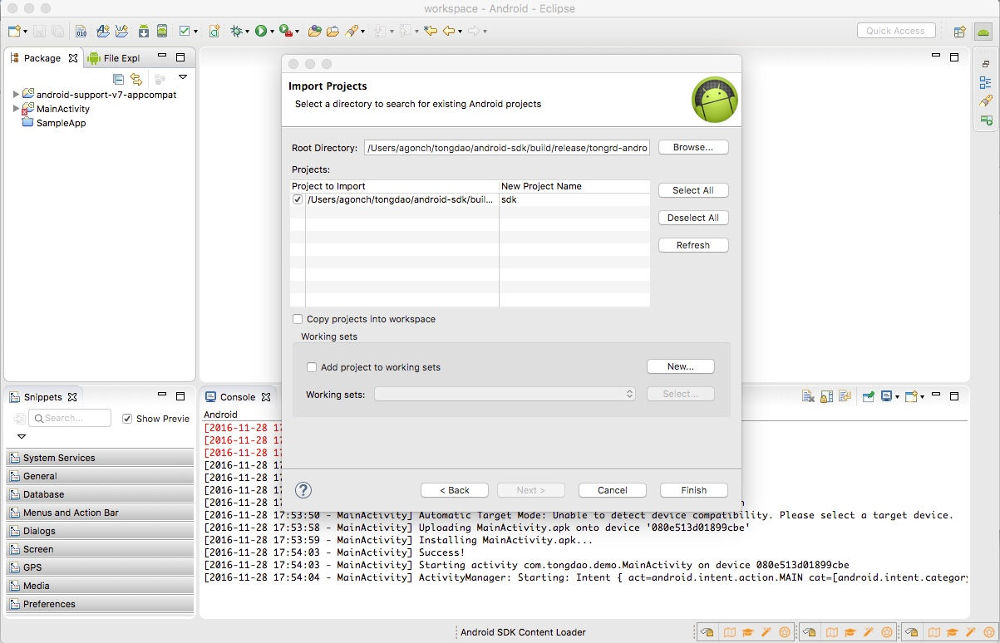
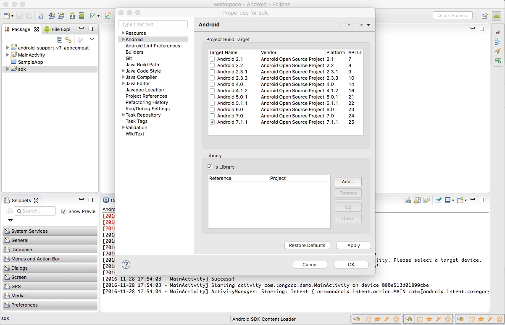
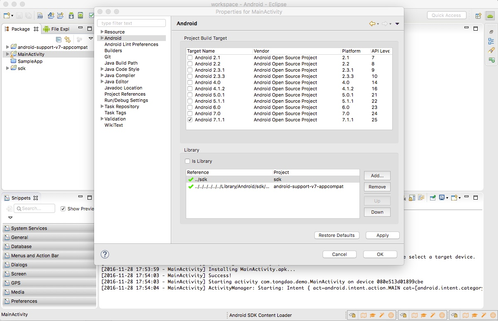

# Quick Start

The Tongdao API for iOS can be configured in two ways. If you use Cocopods see the "Quick Start - Cocopods" section. Otherwise, if you did not use Cocopods, see the "Quick Start - Manual installation" section.
 
 

### 1. Cocopods Installation

Installing the SDK via the iOS CocoaPod automates the majority of the installation process for you.

install this SDK.
Simply run the following command to get started:

     $ sudo gem install cocoapods

<b>Note:</b> If you are prompted to overwrite the rake executable please refer to the Getting Started Directions on [CocoaPods.org][cocopods] for further details.

<b>Note:</b> If you have issues regarding CocoaPods, please refer to the CocoaPods [Troubleshooting Guide][cocopodsTroubleshooting].
 
 
####CONSTRUCTING THE PODFILE.

Now that you’ve installed the CocoaPods Ruby Gem, you’re going to need to create a file in your Xcode project called Podfile.

Add the following line to your podfile and save it within your Xcode project

     pod 'TongDaoSDK', '~>3.2.3'
 
 
####INSTALLING THE TONGDAO SDK

To install the TongDao SDK Cocoapod, navigate to the directory of your Xcode app project within your terminal and run the following command:

     pod install

At this point you should be able to open the new Xcode project workspace created by CocoaPods.
You may now continue to step 3.
  
### 2. Manual installation

To start, download the Tongdao SDK from here:
 
<h4>
<a href="#"><b>[TongDao SDK][TongDaoSDK]</b></a>
</h4>
 
Unpack it and you will see two projects: demo and sdk. In Eclipse, click "File" -> "Import". Choose "Android" -> "Existing Android Code Into Workspace"

Once the SDK project is imported, right-click it and click "Properties". Then click on the "Android" section on the left. Make sure the <b>build target</b> of the SDK is set to <b>Android 7.1.1 (api 25)</b>.
Also, make sure that <b>"Is Library"</b> is checked.

Now, right-click on your own project, click "Properties". Go into the "Android" section and make sure that "SDK" is added as a library.

### 3. Code Integration
 
Next, you will need an `Application` object. If you already have an application object in your code, skip this part.

 
In your `AndroidManifest.xml` add the following:

<uses-permission android:name="android.permission.INTERNET" />
<uses-permission android:name="android.permission.READ_PHONE_STATE" />
<uses-permission android:name="android.permission.ACCESS_NETWORK_STATE" />

<application
...
android:name="TongDaoApplication"
...>

You can replace `TongDaoApplication` with whatever other name you'd like.
 
 

In your `TongDaoApplication`, add the following code:

public class TongDaoApplication{

...

private TongDao tongDao;

@Override
public void onCreate() {
super.onCreate();
if (tongDao == null){
tongDao = TongDao.getInstance(this,DataTool.APP_KEY);
}
}

synchronized public TongDao getTongDao() {
if (tongDao == null){
tongDao = TongDao.getInstance(this,DataTool.APP_KEY);
}
return tongDao;
}

...

}

now you'll be able to access the TongDao SDK through this object in your activities.

If you <b>have the user ID</b> of your app's user, you can call our SDK this way instead:

tongDao = TongDao.getInstance(this,DataTool.APP_KEY,userId);

 
### 4. Logging in

When the user logs in, you can call this function:

tongDao.login(appContext, userId);
 
### 5. Logging out

Likewise, when the user logs out, you can call this function:

tongDao.logout(appContext);

 
 
### 6. Next Steps

That’s it, TongDao is now integrated in your application ! Take a look at the next steps to unleash TongDao full potential.
 
 
<!--#### [Send your users a push, in-app, email or sms message][push] -->
#### [Build your user profiles][profile] 
#### [Track E-Commerce activity][ecommerce] 
<!-- [Activate Retargeting][ -->
#### [Help on Deep Links][deeplinks] 

<!--[push]: push/intro.md-->
[profile]: user_profile.md
[ecommerce]: ecommerce.md
[deeplinks]: deeplinks.md
[cocopods]: http://guides.cocoapods.org/using/getting-started.html
[cocopodsTroubleshooting]: http://guides.cocoapods.org/using/troubleshooting.html
[TongDaoSDK]: https://github.com/tongrd/ios-demo/tree/master/Frameworks
